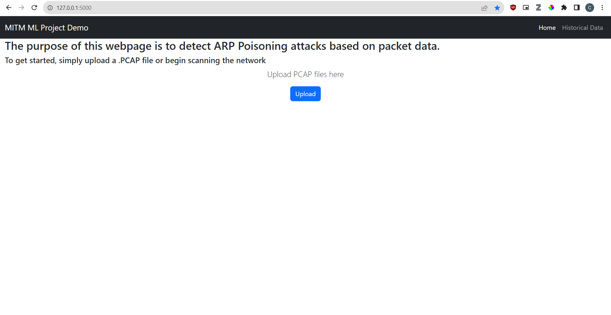

<!-- ABOUT THE PROJECT -->
## About The Project
Created by Christian Culanag and Miguel Muniz, this repository contains the application for the final Networking project for CPE 400. 



For our project, we trained an Long Short-Term Memory (LSTM) model to detect Man-in-the-Middle (MITM) attacks based on a series of network traffic data. Specifically, the network anomaly we will be focusing on is ARP poisoning attacks. A Flask Web Server application is used to interface with the LSTM model. The user is able to upload packet capture (PCAP) files, which will be analyzed by our trained model. The website will then highlight the packets the model determined to be suspicious for the user.

### Built With
The application was created using Flask for the webserver and PyTorch + Lightning for the model. 

### Flask 
Flask is a lightweight and extensible web framework for Python, designed to make it easy to build web applications quickly and with minimal boilerplate code. Flask is used to provide a simple user interface to interace with the LSTM model. 

The Flask Web Application was designed with the Model-View-Controller pattern in mind. This allows for future extensibility and maintainability with the potential for future AI Models to be utilized in this application. For now, this repository only contains an ARP Poisoning LSTM model.

###LSTM Model 

### PyTorch Lightning
PyTorch Lightning is used to train the model. It is a lightweight PyTorch wrapper for high-performance AI research. We use its framework to structure and train the model. 

Lightning was use in this project by first creating a LightningModule. This module contains the model for LSTM, the training loop with fowards and steps and finally the optimizer. The LightningModule is then passed to a Trainer. The Trainer handles the training loop and other training details.

### LSTM Model + Training
After getting model configurations from Lightng module/clas, the model is then trained using the splited dataset. The model is trained for 10 epochs with a batch size of 64. The model is trained using the Adam optimizer with a learning rate of 0.001. The model is trained on a GPU if available.

### LSTM Model + Testing 
After training, the model is tested on the test dataset.The model is tested using the split dataset from earlier and then tested. It then creates


### LSTM Model + Predictions


<!-- GETTING STARTED -->
## Getting Started

To get the local Flask server up and running, follow these steps.

### Prerequisites

The application requires the following applications
* Python 3.3 with PIP and venv

  For Debian-based (Ubuntu) Systems:
  ```sh
  sudo apt-get install -y python3
  sudo apt install -y python3-pip
  ```
  
  
  Python Versions < 3.3 do not come preinstalled with venv. 
  The venv package is not necessary to install the application, but is convenient for ensuring isolated Python environments, especially when working on multiple projects.

  If you'd like to install venv, the following command will work for Debian-Based Systems (version 3.10 of Python).
  ```sh
  sudo apt install python3.10-venv
  ``` 

* ML libraries

  For Debian-based (Ubuntu) Systems:
  ```sh
  placeholder
  ```


### Installation

_Here's how to utilize the application._

1. Get a free API Key at [https://example.com](https://example.com)
2. Clone the repo
   ```sh
   git clone https://github.com/your_username_/Project-Name.git
   ```
3. Install NPM packages
   ```sh
   npm install
   ```
4. Enter your API in `config.js`
   ```js
   const API_KEY = 'ENTER YOUR API';
   ```

<!-- USAGE EXAMPLES -->
## Usage

Use this space to show useful examples of how a project can be used. Additional screenshots, code examples and demos work well in this space. You may also link to more resources.
